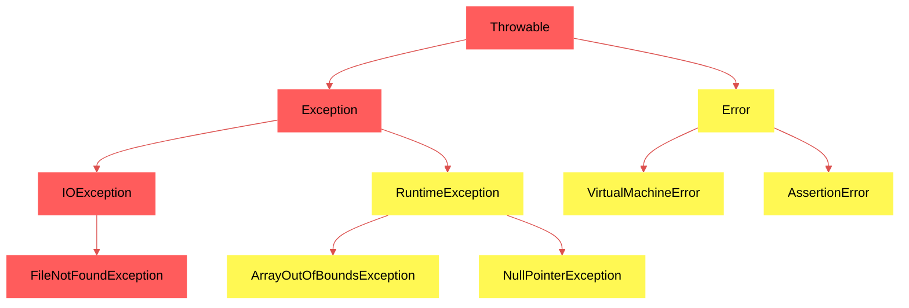

# apresentacao-bim2-2024b-joselitosn
> **Disciplina:** ELC117 - Paradigmas de Programação - 2024b  
> **Aluno:** Vinicios Ragagnin Portella  
> **Apresentação:** Pesquisar sobre exceções em Java: hierarquia de classes e um exemplo com IOException.
---
# Exceções em Java: Hierarquia de Classes

> Uma exceção é um evento que ocorre durante a execução de um programa e interrompe o fluxo normal das instruções do programa. 

Podem ser vistas de duas formas:
- por categoria (verificadas e não verificadas);
- por hierarquia de classes.

## Hierarquia de Classes de Exceções



## Classe _Throwable_
Superclasse de todos os erros e exceções na linguagem Java. Apenas objetos da classe ou subclasses podem ser utilizadas com as cláusulas _throw_ e _throws_.

## Exceções do tipo _Error_ e subclasses
Indicam condições anormais sérias que normalmente não devem ser capturadas, pois seu tratamento dificilmente pode ser corrigido durante a execução do programa, sendo categorizadas como exceções do tipo não verificadas.  

Ex.: Falta de memória para alocar objetos, erros de asserção, incompatibilidade entre bibliotecas compiladas em diferentes versões do Java, etc.

```java
// Execute com o comando 'java -ea ExemploAssertionError' para habilitar asserções
public class ExemploAssertionError {
    public static void validaIdade(int idade) {
        try {
            assert idade >= 0 : "Idade não pode ser negativa";
            System.out.println("Idade válida: " + idade);
        } catch (AssertionError e) {
            System.err.println("Erro de asserção: " + e.getMessage());
        }
    }

    public static void main(String[] args) {
        validaIdade(-5);
    }
}
```

## Exceções do tipo _Exception_ e subclasses
Indicam condições de erro que a aplicação pode querer capturar e tratar para continuar a execução do programa.

```java
import java.io.File;
import java.io.FileNotFoundException;
import java.util.Scanner;

public class ExemploFileNotFoundException {
    public static void lerArquivo(File arquivo) {
        try {
            Scanner input = new Scanner(arquivo);
        } catch (FileNotFoundException e) {
            System.err.println("Falha: " + e.getMessage());
        }
    }

    public static void main(String[] args) {
        File arquivo = new File("arquivo-nao-existente.txt");
        lerArquivo(arquivo);
    }
}
```

## Exceção do tipo _IOException_
Utilizada para capturar qualquer tipo de sinal emitido quando uma operação do tipo entrada e saída apresenta alguma falha. Normalmente não é utiliza diretamente, apenas suas subclasses.  

Ex.: Erro ao conectar a um endereço de rede (SocketException), tentativa de leitura após o fim de arquivo (EOFException), leitura de arquivo comprimido corrompido (ZipException), etc.

```java
import java.io.*;
import java.net.*;

public class ExemploIOException {
    public static void main(String[] args) {
        String arquivo = "resposta.txt";
        String host = "example.com";
        int porta = 80;
        
        try {
            Socket socket = new Socket(host, porta);
            PrintWriter out = new PrintWriter(socket.getOutputStream(), true);
            BufferedReader in = new BufferedReader(new InputStreamReader(socket.getInputStream()));
            FileWriter fileWriter = new FileWriter(arquivo);
            
            // Enviar requisição HTTP GET
            out.println("GET / HTTP/1.1");
            out.println("Host: " + host);
            out.println("Connection: close");
            out.println();
            
            String linha;
            while ((linha = in.readLine()) != null) {
                fileWriter.write(linha + "\n");
            }
            
            System.out.println("Resposta salva em " + arquivo);
            
        } catch (IOException e) {
            System.err.println(e.toString());
        }
    }
}
```

---
## Referências
[11 Erros que desenvolvedores Java cometem quando usam Exceptions | Oracle Brasil](https://www.oracle.com/br/technical-resources/article/java/erros-java-exceptions.html)  
[Unchecked Exceptions — The Controversy (The Java™ Tutorials > Essential Java Classes > Exceptions)](https://docs.oracle.com/javase/tutorial/essential/exceptions/runtime.html)  
[Error (Java SE 21 & JDK 21)](https://docs.oracle.com/en/java/javase/21/docs/api/java.base/java/lang/Error.html)  
[Java Assertions](https://codegym.cc/groups/posts/java-assertions)  
[Trabalhando com Exceções em Java - DevMedia](https://www.devmedia.com.br/trabalhando-com-excecoes-em-java/27601)  
[IOException (Java Platform SE 8 )](https://docs.oracle.com/javase/8/docs/api/?java/lang/Throwable.html)  
[Claude.ai](https://claude.ai/)  
