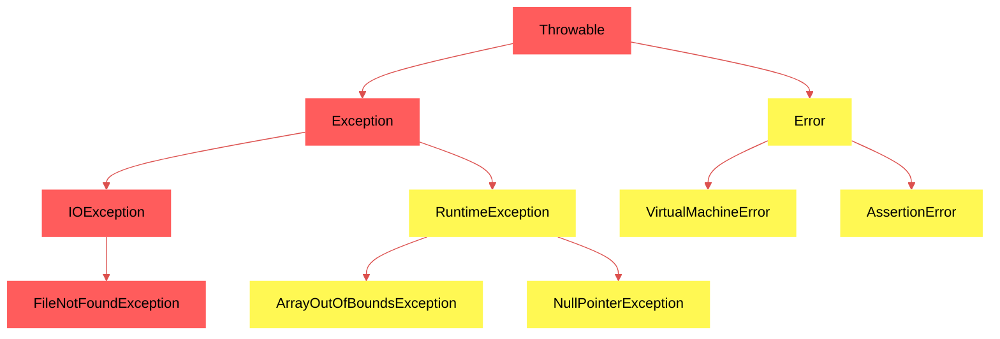

# Exceções em Java: Hierarquia de Classes

> Uma exceção é um evento que ocorre durante a execução de um programa e interrompe o fluxo normal das instruções do programa. 

Podem ser vistas de duas formas:
- por categoria (verificadas e não verificadas);
- por hierarquia de classes.

## Hierarquia de Classes de Exceções



## Exceções do tipo _Error_ e subclasses
Indicam condições anormais sérias que normalmente não devem ser capturadas, pois seu tratamento dificilmente pode ser corrigido durante a execução do programa, sendo categorizadas como exceções do tipo não verificadas.  

Ex.: Falta de memória para alocar objetos, erros de asserção, incompatibilidade entre bibliotecas compiladas em diferentes versões do Java, etc.

```java
// Execute com o comando 'java -ea ExemploAssertionError' para habilitar asserções
public class ExemploAssertionError {
    public static void validaIdade(int idade) {
        try {
            assert idade >= 0 : "Idade não pode ser negativa";
            System.out.println("Idade válida: " + idade);
        } catch (AssertionError e) {
            System.err.println("Erro de asserção: " + e.getMessage());
        }
    }

    public static void main(String[] args) {
        validaIdade(-5);
    }
}
```

## Exceções do tipo _Exception_ e subclasses

---
## Referências
[11 Erros que desenvolvedores Java cometem quando usam Exceptions | Oracle Brasil](https://www.oracle.com/br/technical-resources/article/java/erros-java-exceptions.html)  
[Unchecked Exceptions — The Controversy (The Java™ Tutorials > Essential Java Classes > Exceptions)](https://docs.oracle.com/javase/tutorial/essential/exceptions/runtime.html)  
[Error (Java SE 21 & JDK 21)](https://docs.oracle.com/en/java/javase/21/docs/api/java.base/java/lang/Error.html)  
[Java Assertions](https://codegym.cc/groups/posts/java-assertions)  
